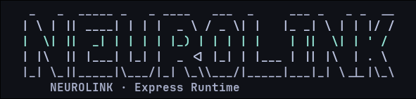
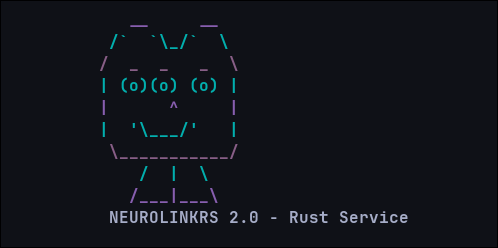

# NeuroLink Monorepo v2.0

Two separate apps now live in this repo:

- `neurolink` (Express, Node.js) in `apps/neurolink`
- `neurolinkrs` / `neurolinkd` (Rust, Axum) in `apps/neurolinkrs`

## Run

Express app (`neurolink`, default `3000`):

```bash
npm run dev:neurolink
```

Rust app (`neurolinkrs`, default `3001`):

```bash
npm run dev:neurolinkrs
```

Rust daemon command (`neurolinkd`, default `3001`):

```bash
npm run dev:neurolinkd
```

## Build

Rust release build:

```bash
npm run build:neurolinkrs
```

## CLI Banners

When you launch commands in a terminal, each CLI prints a colored ASCII banner:

- `neurolink` -> `NEUROLINK · Express Runtime`
- `neurolinkrs` -> `NEUROLINKRS 2.0 - Rust Service`
- `neurolinkd` -> `NEUROLINKD 2.0 - Rust Daemon`

| neurolink | neurolinkrs |
| --- | --- |
|  |  |

## Demo Video

- `docs/video/neurolink_demo_both_servers.mp4`

## Core parity (both apps)

- Upload batches via web UI (folder-first flow + multi-file fallback)
- List uploaded files and batches
- Download individual files
- Download batch archive (ZIP)

## Download differences

- Rust (`neurolinkrs` / `neurolinkd`): supports file and batch ZIP downloads only.
- Express (`neurolink`): keeps chunk download API endpoint for compatibility.

## Common endpoints (both apps)

- `GET /`
- `GET /health`
- `GET /files`
- `GET /uploads`
- `GET /shared/:filename`
- `GET /download/batch/:batch_id`
- `POST /transfer/init`
- `POST /transfer/chunk`
- `POST /transfer/complete`

Express-only endpoint:

- `GET /download/chunk/:filename?index=<n>&chunk_size=<bytes>`
